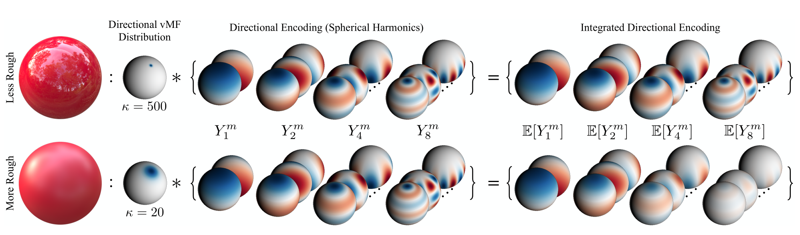
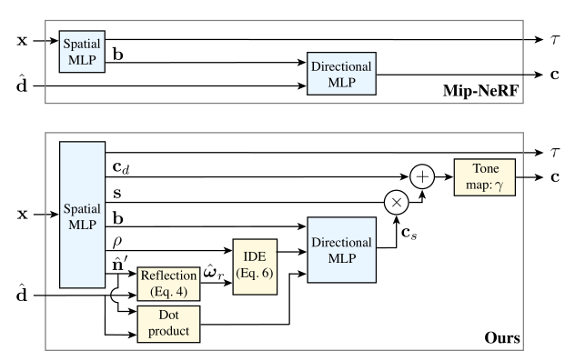

- Introduction
	- Ref-NeRF에서는 기존 NeRF에서 glossy surface의 정확한 rendering을 하지 못한다는 단점을 보완하였다. 기존 NeRF의 outgoing radiance를 reflected radiance로 대체하였으며 적절한 normal vector의 수정을 하였다. 
	- 기존 NeRF에서 specular surface의 경우 viewing direction의 변화에 따라 렌더링 결과값이 급격하게 변화하는데 기존 NeRF의 input값을 변경해줌으로써 specular surface를 좀 더 잘 표현 할 수 있도록 하였다. 

- Intergrated Directional Encoding

기존 NeRF의 positional encoding(sin function 사용)과 다르게 각 direction을 spherical harmonics로 표현한다. 각 component의 encoding은 spherical harmonic function이며 vMF distribution을 사용하였다. 
directional MLP에서 기존 NeRF는 single direction vector를 사용하였는데 Ref-NeRF에서는 reflection vector의 distribution을 사용하였다. 여기서 distribution이 von Mises-Fisher distribution이다. 

- von Mises-Fisher distribution
	- 원 위에서 sampling 되는 data 표현
	- 

- Diffuse and Specular Colors
	- 
	- 기존의 NeRF와 다르게 Spatial MLP에서는 diffuse, Directional MLP에서는 specular color를 출력한다. specular는 물체의 재질과 반사각을 고려한 color이기 때문에 Reflection과 재질을 고려한 Intergrated Directional Encoding을 통하여 Directional MLP에서 값을 출력한다. 
	- color는 diffuse color와 specular color에 specular tint를 곱한 값의 합으로 구할 수 있다. 

- Accurate Normal Vectors
	- 기존 NeRF에서 normal vector를 구하는 방식은 volume density의 gradient로 구하는 것이다. 
	- 기존 NeRF에서는 물체 내부에 emitter들을 embedding함으로써 fake한 specular highlight를 구현하였다.
	- Ref-NeRF에서는 reflection direction 계산을 위해 predicted normal을 사용한다. 각 ray상의 position에 대해 spatial MLP로 부터 3 vector output을 받아 normalize해 predicted normal을 얻는다. 그 후 기존 NeRF 방식의 normal vector와 묶어 penalty를 준다. MLP를 거치기 때문에 기존 normal vector보다 부드러운 경향을 보인다. 
	- back-facing normal 사용 -> camera 방향과 90도가 넘는 normal에 대해서는 0으로 만든다. 

- Plan
	- Ref-NeRF code 분석
	- 현재 code의 train과정에 대해서 code를 실행시켰지만 rendering 결과를 얻지 못한 상태이다. 이번 주 내로 code 실행시켜 결과를 얻을 예정이다.
	- 다양한 dataset에 대하여 결과를 비교해 보고 glossy surface부분은 기존 NeRF와 비교해 볼 예정이다. 

