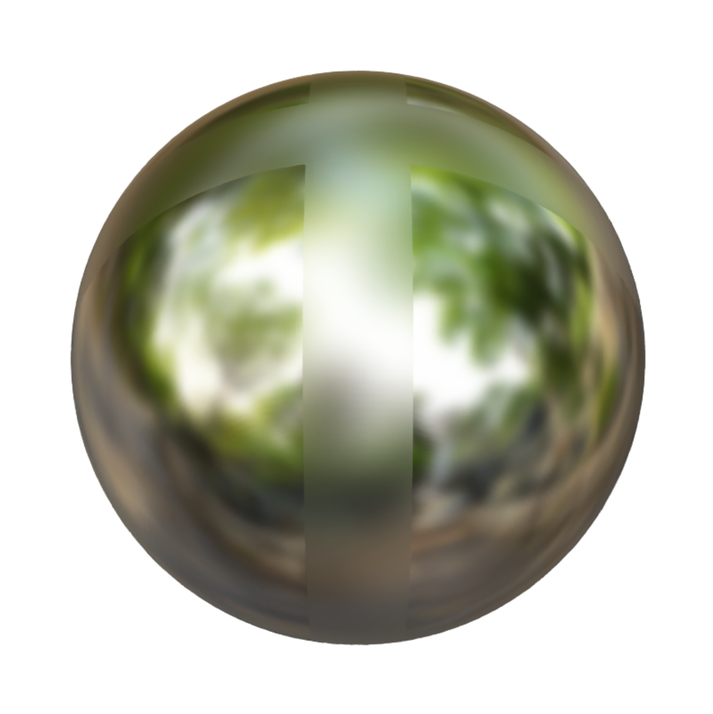

- Experiment
	- Ref-NeRF의 training time은 매우 오래걸린다. 따라서 NeRF-Factory에서 만들어놓은 checkpoint를 사용하여 training을 하고 rendering을 해보았다. 
	- ball, coffee, car 총 3개의 dataset에 대해서 code를 돌렸으며 3개 dataset 모두 specular surface에 대하여 좋은 결과를 보였다. 
	
	-   
	- 200장의 testset에 대하여 rendering을 진행하였는데 각각 dataset에 대하여 평균 pnsr은 42, 30, 32 정도로 측정되었다. 
	- car dataset에 대하여 testset의 원본 사진과 rendering 된 결과를 비교해보았다.
	-  
	- 왼쪽 사진은 car test dataset에 대한 ground truth이고 오른쪽 사진은 학습한 후 rendering한 결과이다. specular surface 부분에 대하여 집중해서 볼 때 조금의 차이말고는 완벽하게 rendering이 된 것을 볼 수 있다.
	- 측정한 psnr값은 대략 37.81이다.

