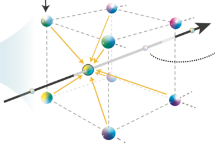

Encoding 종류
- ✔️ **Positional Encoding** 
	- NeRF에서 Neural Network의 input값으로 단순히 position (x, y, z)와 viewing direction (𝜃, 𝜙) (크기가 5인 벡터)를 입력하는 것이 아니라, Frequency Encoding과정을 거쳐 해당 벡터를 크기가 60인 벡터로 바꾸어 입력한다.
	- 
	- position (x, y, z)에 대해서는 L=10이 적용되어 좌표 하나당 크기가 20인 벡터로 증폭된다. Neural Network에 대입된다. viewing direction (𝜃, 𝜙)에 대해서는 먼저 Cartesian unit vector로 변환되어 3개의 요소로 변경된 후, 위 수식에 L=6이 적용되어 최종적으로 viewing direction하나당 12개의 벡터로 증폭된다.

- ✔️ **Parametric Encoding** 
	- 
	- Parametric Encoding이란, input vector를 인코딩 하는 과정에서 자료구조에 parameter 들을 할당하여 학습 시 지속적으로 업데이트를 해 나간다는 의미이다.
	- 기존 Neural Representation에서는 MLP의 각 layer의 weight와 bias를 parameter로 두고, 매 iteration시마다 weight와 bias의 값을 update한다. 하지만 Parametric Encoding을 적용하면, MLP의 weight, bias 뿐 아니라 MLP를 거치기 전에 위치한 feature vector까지 parameter로 취급하여 이것까지 매 back-propagation마다 업데이트를 하게 된다.
	- Parameter Encoding을 도입 시, 메모리 사용량이 증가하지만 연산 량은 줄어들게 된다. 메모리 사용량이 늘어나는 이유는, numerical encoding처럼 단순히 input vector에 수식을 적용하는 것이 아니라 encoding 과정에서 parameter를 할당하고 이것이 메모리 공간을 소모하기 때문이다.

