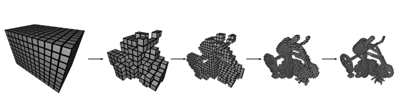
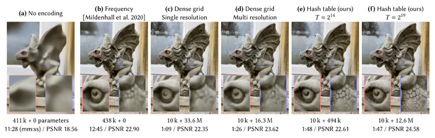

- ✔️ Dense & Sparse Parametric Encoding
	- 
	- Dense parametric encoding과 Sparse parametric encoding의 차이는 ‘물체가 존재하지 않는 영역에 parameter(feature)를 할당하는가’ 이다.
	- Dense parametric encoding의 경우 모든 공간에 feature vector를 사용하기 때문에 메모리 사용량이 Sparse에 비해 많다.  3D reconstruction을 하고 공간을 정육면체라고 했을 때, 우리가 관심있는 것은 물체의 표면뿐이지만 feature vector는 모든 공간에 할당을 한다면 𝑂(𝑁^2)의 공간 복잡도를 가질 수 있는데 𝑂(𝑁^3)의 공간 복잡도가 적용된 것이므로 메모리 낭비라고 할 수 있다.
	- Sparse parametric encoding의 경우 non-interested 영역에 parameter를 할당하지 않음으로써 Dense parametric encoding의 단점을 보완한다. sparse parametric encoding을 사용한 사례로는 sparse grid, octree 등이 있다. 

- ✔️ Encoding 비교
	- 
	- 그림은 인코딩 방식 별 파라미터 수와 연산 시간을 비교한 것이다. (b)가 original NeRF이며 (e)가 Instant-NGP에서 제안한 방식이다. 그림 아래 첫 줄은 MLP의 parameter수 + encoding과정의 parameter수를 나타내며, 두 번째 줄은 PSNR과 그 PSNR으르 얻기 위해 걸린 시간을 의미한다. original NeRF에 비해 Instant-NGP를 사용할 경우 encoding과정의 parameter수는 일정 부분 생겼지만 MLP의 parameter수가 감소했고, 연산 시간은 대폭 감소한 것을 확인할 수 있다.

- ✔️ Multiresolution Hash Encoding
	- 
	- Multiresolution Hash Encoding의 절차는 위의 사진과 같다. 가장 먼저 L개의 d차원 grid를 정의한다. 한 level은 Nl의 resolution을 가지며 그림에서 N0=2, N1=3이 된다. 차원 d는 task에 따라 달라지며 그림의 image의 경우에는 d=2, 그리고 NeRF의 경우 d=3이된다. 
	- 다음으로 각각의 level을 F차원의 T개의 feature vector로 지정한다. F차원의 T개의 feature vector는 hash table을 구성하게 된다. Input coordinate의 좌표는 가까운 pixel이나 voxel로 mapping되게 된다. Image의 경우 4개, voxel의 경우 8개로 mapping 된다. 
	- Mapping된 cell의 꼭지점이 hash table의 feature vector로 mapping 된다. 그 후 d차원의 linear interpolation이 진행되면 back propagation을 통해 미분이 가능해지기 때문에 discrete하지 않게 하기 위해 interpolation을 해준다. 
	- 마지막으로 Interpolate되어 만들어진 feature vector에 extra parameter를 concat하여 MLP의 input으로 넣어준다.
