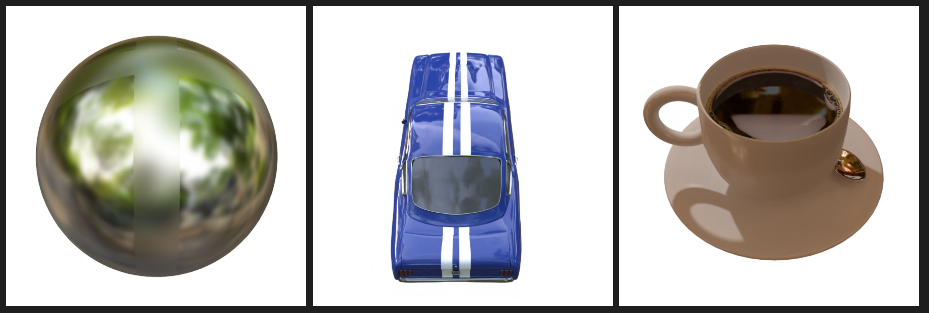
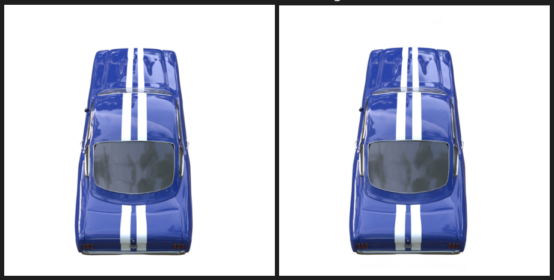
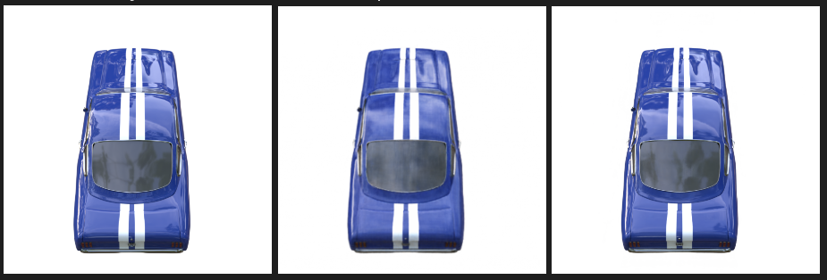

- Experiment
	- Ref-NeRF의 training time은 매우 오래걸린다. 따라서 NeRF-Factory에서 만들어놓은 checkpoint를 사용하여 training을 하고 rendering을 해보았다. 
	- ball, coffee, car 총 3개의 dataset에 대해서 code를 돌렸으며 3개 dataset 모두 specular surface에 대하여 좋은 결과를 보였다. 
	
	- 
	- 200장의 testset에 대하여 rendering을 진행하였는데 각각 dataset에 대하여 평균 pnsr은 42, 30, 32 정도로 측정되었다. 
	- car dataset에 대하여 testset의 원본 사진과 rendering 된 결과를 비교해보았다.
	- 
	- 왼쪽 사진은 car test dataset에 대한 ground truth이고 오른쪽 사진은 학습한 후 rendering한 결과이다. specular surface 부분에 대하여 집중해서 볼 때 조금의 차이말고는 완벽하게 rendering이 된 것을 볼 수 있다.
	- 측정한 psnr값은 대략 37.81이다.

- Experiment2
	- 기존 NeRF와 Ref-NeRF를 비교하기 위해 같은 dataset으로 train을 진행한 후 특정 camera 시점에서 view synthesis를 진행해 보았다. 
	- 
	- 가장 왼쪽 사진은 testset의 ground truth이며 다음 rendering된 사진들이 각각 NeRF와 Ref-NeRF이다. 
	- NeRF rendering 결과는 psnr값이 28.31로 Ref-NeRF의 37.81보다 낮았다. NeRF의 경우 대부분의 자동차의 결과가 잘 나왔지만 specular surface의 rendering이 부분적으로 실패하였다. 

👀Plan
* Ref-NeRF code review를 할 예정이다.
* Ref-NeRF에서 사용하는 Integrated Directional Encoding에 대해 code 분석할 예정이다.

  