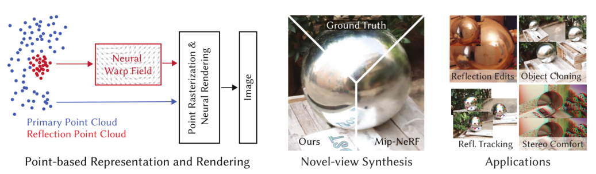
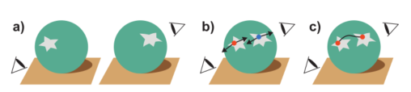

* Neural point Catacaustics 논문에서는 view sysnthesis 할 때의 specular surface에서의 반사문제에서 더 나아가 곡면에서의 반사를 point-based representation and rendering을 사용하여 해결하였다. 논문의 핵심은 NeRF의 implicit representation과 달리 reflection point cloud를 사용한 explicit representation이다. Reflection Point Cloud는 neural wrap field로 대체되며 Primary Point Cloud는 나머지 scene을 나타낸다. 
* Point based approach는 Neural radiance fields에 대한 low frequency쪽 편향을 피하며 inference time이 적고 direct representation을 사용함으로써 scene조작을 쉽게 할 수 있다. 
* 가장 먼저 3D reconstruction stereo를 사용하여 multi-view dataset으로 부터 initial point cloud를 추출하고 3~4개의 image에서 reflection mask를 정의한 후 feature를 사용하여 2가지 종류의  point cloud로 분류한다. 

* shiny object에 대한 modeling은 크게 2가지로 나뉜다. 그림 b(오일러)에서는 fixed representation을 사용하며 방향 변화만을 고려한다. 그림 c(라그랑주)에서는 reflection의 flow를 따라가며 논문에서는 이 방식을 선택하여 Neural Warp Field를 사용하여 reflection flow를 tracking 한다. 