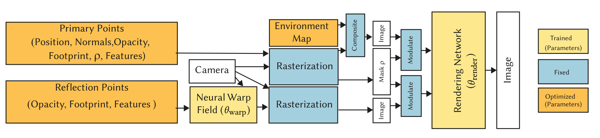

* Catacaustic
	* caustic이란 빛이 물체에 반사되어서 나오는 반사광이 다른 물체에 맺히는 현상이다. viewpoint가 이동할 때 마다 물체에 맺히는 점 P의 궤적이 달라지는데 이때의 궤적을 catacaustic이라고 한다. catacaustic은 반사점 P와 reflector의 shape에 따라 달라지는데, 찾아본 결과, shape에 따라 catacaustic surface는 다양한 형태를 띄게 된다. 아래의 사진은 원형의 reflector에서 반사점인 radiant point를 무한대, 원 외부, 원의 둘레 위, 원 내부로 바꿔가며 생긴 catacaustic의 결과이다. nephroid, cardioid등 다양한 형태를 띄는것을 알 수 있다. 
	* 
	* 반사된 ray들은 오직 catacaustic surface에서 교차하기 때문에 물체에 맺히는 이미지는 catacaustic surface에서만 형성된다. 논문에서는 앞서 말한 Lagrangian methodology를 통해 catacaustic 궤적을 추정하고 reflection을 저장하여 재사용한다. 
	* reflection motion은 Neural Warp Field를 학습함을 통해 learning하고 이 warp field는 input view에 있는 반사부분과 일치하도록 virtual point cloud를 변형한다. 

* Method Overview
	* 
	* curved reflector를 포함한 200장의 wide-baseline photo가 input이며 structure-from-motion(SfM)을 통해 camera calibration을 하며 multi-view stereo(MVS)를 통해 dense point cloud를 추출한다. 그 후 user가 3~4장의 dataset으로 부터 reflector의 coarse mask를 생성한다. 이 mask는 reflection volume을 추출하기 위해 사용된다. 
	* MVS reconstruction을 통해 primary point cloud를 initialize하고 이 point cloud는 diffuse를 나타낸다. 앞서 진행했던 masking을 통해 reflection point cloud를 initialize하며 가장 먼저 reflection point cloud를 Neural Warp Field로 대체한다. 그후 2종류의 point cloud는 EWA splatting을 통해 rasterized 되며 이 rasterized point cloud들은 누락된 geometry를 보완하는데 사용되는 environment map과 합성된다. 결과로 나온 high-dimensoinal feature가  Network로 들어가서 final image를 만들게 된다. 