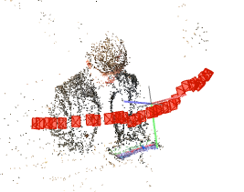

* miv dataset을 사용한 Ref-NeRF
	* Ref-NeRF의 input data는 크게 가상데이터와 실사데이터로 나뉜다. 가상데이터는 원본image, normal map, alpha map이 함께 들어간다. 실사데이터는 normal map을 deep learning외에는 구할 수 없으므로 원본 image만 넣어 학습한다.
	* 원본 image외에 poses_bounds.npy라는 camera callibration parameter가 담긴 npy파일을 함께 넣어준다. 이 poses_bounds.npy file을 얻기 위해서는 colmap이라는 program을 사용해야 한다. 
	* colmap을 사용하면 feature extraction과 feature matching작업을 통해 camera callibration작업을 진행한다. 
	* 다음은 iphone을 사용하여 camera로 사진 40장을 촬영 후 colmap을 실행한 결과이다. 
	* 

* LLFF image2poses.py 사용
	* colmap의 output을 사용하여 Ref-NeRF의 input값인 poses_bounds.npy를 출력한다. 
	* poses_bounds.npy와 원본image를 이용하여 Ref-NeRF에 실사 사진을 학습시킬 수 있다. 

* MIV dataset 사용
	* 

