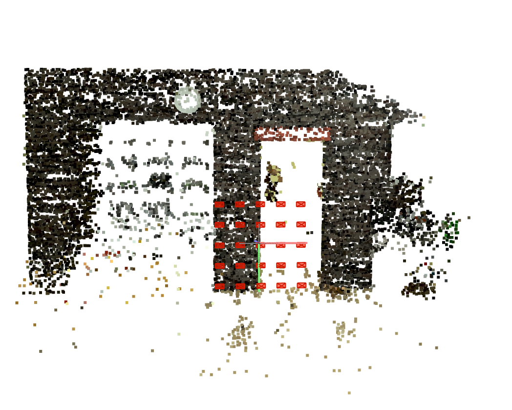
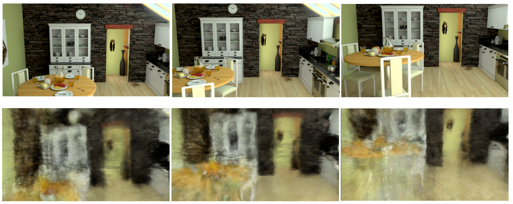
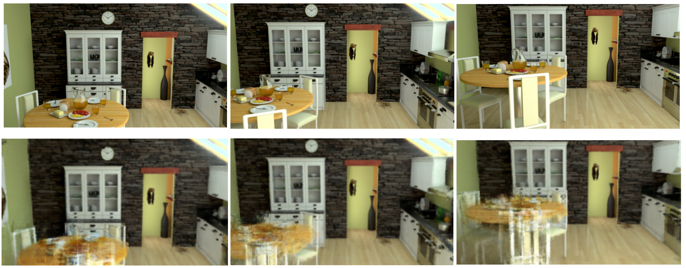

## Result Analysis

* miv dataset을 활용한 Ref-NeRF
	* Etri 측에서 전달받은 NeRF format은 Instant-NGP용으로 Ref-NeRF에선 사용 불가능
		* 별도의 parsing이 필요하다.
	* Colmap을 사용하여 직접 data의 camera parameter 추정
	* 
	* colmap을 통하여 c2w matrix, focal, depth 등의 정보 획득하여 input으로 사용

* Results (Ref-NeRF)
* 
* mean PSNR: 13.476
* 1epoch(하루) 학습시켰으며 현재 더 많은 epoch으로 학습 중이다. 
* Results(Original NeRF)
* 
* colmap을 사용한 camera parameter의 문제점이 있는지 확인하기 위해 같은 parameter로 Original NeRF 실행결과 Ref-NeRF에 비해 결과가 좋게 나왔다.
* 현재 3epoch 학습중에 있으며 학습이 완료된 후 결과 확인할 예정이다. 

* NeRF, Ref-NeRF 에서의 iteration 및 epoch
	* 예를들어, image.pixels = 400 * 400 이라면
	* 1 iteration = 1장의 image 처리 기준 단위
	* 1장의 image 처리 = (400 x 400 = 160,000 pixel, 즉 총 160,000개의 ray가 이론상 존재하는데 그중 4096개의 ray를 sampling.  또한,  1개의 ray당 256개의 점을 sampling 한다. 
	  따라서, 총 4096 x 256 = 2^20 point 처리)
	* 현재 보유하고 있는 source code 상, nerf는 100,000(10만) iteration ref-nerf는 250,000(25만) 기준으로 logging을 한다
	* 사용한 dataset은 총 25장의 input image로 구성되어 있는데, 
	  nerf의 경우 100,000 / 25 = 4,000 epoch 이라고 할 수 있다.
	  ref-nerf의 경우 user의 편리성을 위해 250,000 iteration을 1epoch으로 치부하는 것 같은데,
	  정확한 분석을 위해서는 코드를 조금 더 봐야 할 것 같다.
	  위 계산대로 라면, 250,000 / 25 = 10,000 epoch 학습했다고 말 할 수 있다.
	* 참고로, 1 epcoh의 본래 정의는 train_set에 있는 모든  data를 1번씩 학습 한 단위이다.

## TODO

* 보다 빠르게 결과를 확인하기 위해서 1/8 resolution 확인 할 예정이다.
* ref-nerf key contribution 중 하나인 normal map estimation의 quality가 의심된다. 현재, pretrained model도 normal map이 요구되는 real data에 대해서는 check point file이 제공되지 않는다. 따라서, normal estimation 된 normal data를 따로 추출해서 ground truth와 비교해 보는 작업이 필요하다. 

