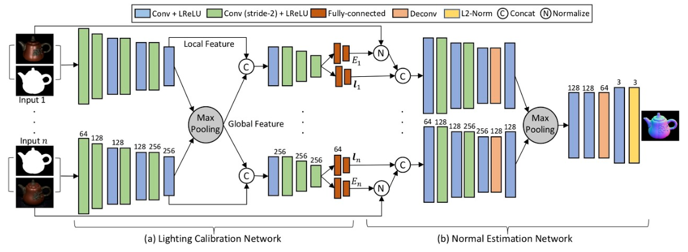

Learning schedule : 250k optimization iterations with a batch size of 2 14 , using the Adam optimizer with hyperparameters β 1 = 0.9, β 2 = 0.999, ε = 10 −6 ,a learning rate that is annealed log-linearly from 2 × 10 −3 to 2 × 10 −5 with a warm-up phase of 512 iterations, and gradient clipping to a norm of 10 −3. (Ref-NeRF)

* NeRF 논문에 따르면 각각의 optimization iteration에서 set of all pixels in the dataset에서 batch of camera rays를 랜덤으로 sampling한다고 명시되어 있다.
* 따라서 NeRF에서는 epoch이 25000이다. 
* Ref-NeRF에서는 250000이 iteration이다. 
* mip NeRF에서는 1 million iteration이다. 
* mip-NeRF 실행 결과

* normal estimation(SDPS-Net): 이미지로부터 normal map 얻기
	* 하나의 객체를 여러 광원으로 찍은 이미지와 mask image를 input으로 받고 최종적으로 normal map image를 output으로 생성. 
	* 
	* Ref-NeRF의 원래 input은 alpha map, rgb map, normal map이다. 