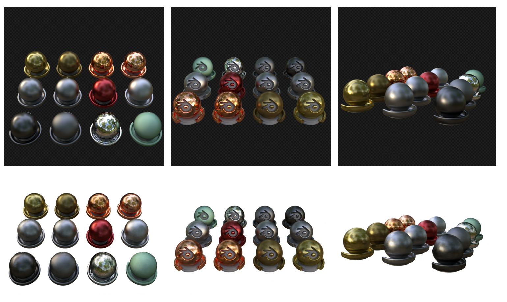
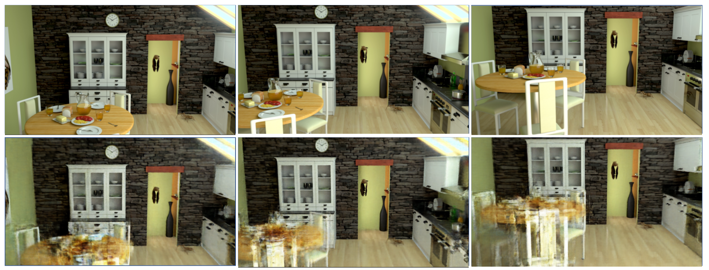
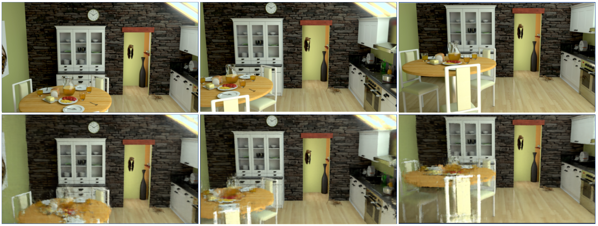
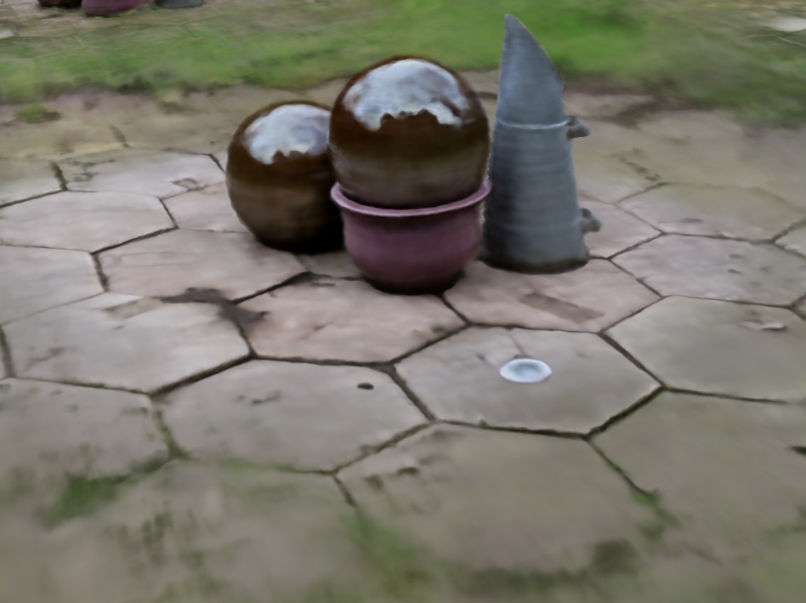

* **Key Analysis**
nerf(mipnerf, refnerf 포함)에 사용되는 dataset은 종류도 많고 다양하기 때문에 이를 전처리하는 코드와 config file을 dataset의 특성에 맞게 선택하는 것이 굉장히 중요하다.
지금까지는 normal map이 없는 실사 data를 처리하는 config에 초점을 두어 real.gin이라는 config file을 사용했는데 결과가 매우 실망스러웠다. 
그러던 와중 normal map을 요구하지 않는 data를 처리하는 다른 config file (llff.gin)을 찾게 되었고 해당 config로 실험을 했을 때 output의 품질이 상당히 개선되었다. (PSNR 상승) 
두 config file의 유일한 차이는 ndc_coordinate의 사용 유무에 있는데, real.gin은 사용하지 않았고, llff.gin은 사용하였다. 
아래 실험 결과들은 대부분 llff.gin을 config file로 활용하여 실험한 결과이다. real.gin을 사용한 경우는 따로 명시를 하였다. 

* **실험 결과 정리**
	✅Mip-NeRF - 논문 dataset(materials)
	epoch_size:250000, num_epoch:2, PSNR: 30.5, training time: 22:09:57
	Results
	
	
	💧**Mip-NeRF - MIV dataset(kitchen)**
	epoch_size:50000, num_epoch:1, PSNR: 21.8, training time: 2:00:49
	Results
	
	
	💧**Mip-NeRF - MIV dataset(kitchen), resolution 1/16**
	epoch_size:15625, num_epoch:4, PSNR: 35.3, training time: 2:30:18
		Results``
	![[image/mip_resolution.png]]
	
	✅**Ref-NeRF - 논문 dataset(car, coffee, helmet) with normal**
	epoch_size:250000, num_epoch:4, PSNR: 36(average)
	
	
	✅**Ref-NeRF - 논문 dataset(sedan, gardenspheres) without normal**
	epoch_size:250000, num_epoch:2, PSNR: 17.2, config file: real.gin, training time: 50:51:02
	Results
	![[image/ref_gardensphere_result.png]]
	
	💧**Ref-NeRF - MIV dataset(kitchen)**
	epoch_size:250000, num_epoch:2, PSNR: 23.4, training time: 48:26:52
	Results
	
	
	💧**Ref-NeRF - MIV dataset(kitchen), resolution 1/16
	epoch_size:15625, num_epoch:4, PSNR: 35.6, training time: 5:59:23
	Results
	

* **실험 내용 정리**
	* ndc_coordinate =True 일 때, (config file을 llff.gin으로 사용 했을 때) output 품질이 개선 되었다.
	* resolution을 1/16으로 줄였을 때, 해상도의 저하는 불가피하지만, overall psnr이 mipnerf, refnerf 모두에서 높았다.

* **논의 사항**
	❓ **resolution을 줄이면 확대했을 때 사진이 흐려져 specular를 확인할 수 없다.  ▶️ 적절한 resolution 찾기**
	
	❓ **원본 사진으로 사용하고 iteration만 줄였을 때 결과가 비슷하다.  ▶️ 적절한 iteration 수 찾기**
	* 💧Ref-NeRF - MIV dataset(kitchen)
		* epoch_size:50000, num_epoch:1, PSNR: 23.4, training time: 5:00:33
		* 
	
	❓ **kitchen dataset은 object만 있는 논문의 dataset들에 비해 scene이 너무 복잡하여 Mip-NeRF에서 조차 geometry를 잘 인식못하고 있다.  ▶️ 적절한 dataset 필요**
	
	❓ colmap 사용 결과
	