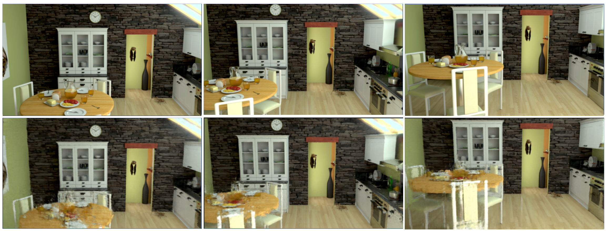
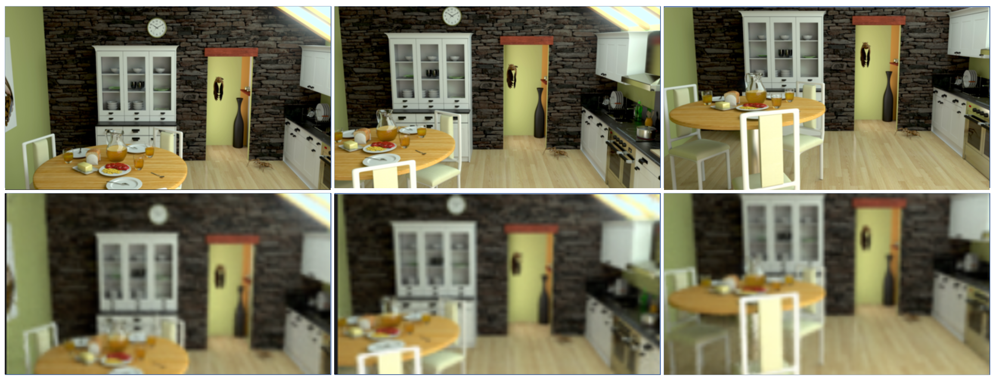
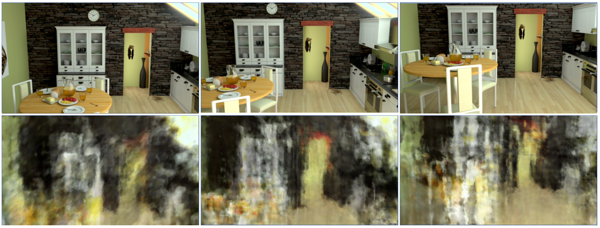
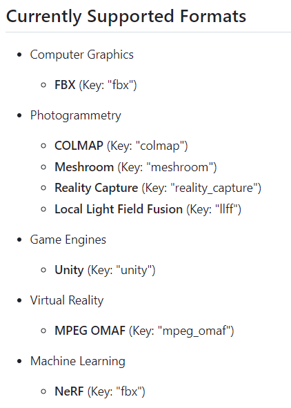

* PSNR 재측정
	* bicubic filter로 1920 x 1080 으로 resize후 psnr 재측정
	* 💧**Ref-NeRF - MIV dataset(kitchen)**
		epoch_size:250000, num_epoch:4, PSNR: 22.720
		Results
		
	* 💧**Ref-NeRF - MIV dataset(kitchen)**
		epoch_size:15625, num_epoch:4, resolution:1/256, PSNR: 22.057
		Results
		

* camera parameter 변경
	* parsing 방법
	* epoch_size:250000, num_epoch:2, training time: 3:29:17
	* 

* 개선 방안
	* ETRI에서 제공해준 json file은 camorph라는 tool을 사용하여 miv json file을 NeRF용 json file로 변경한 것이다. 
	* 
	* MPEG OMAF형식을 NeRF가 아닌, LLFF 형식으로 변환해달라고 요청한 후 결과를 비교해보면 좋을 것 같다. 