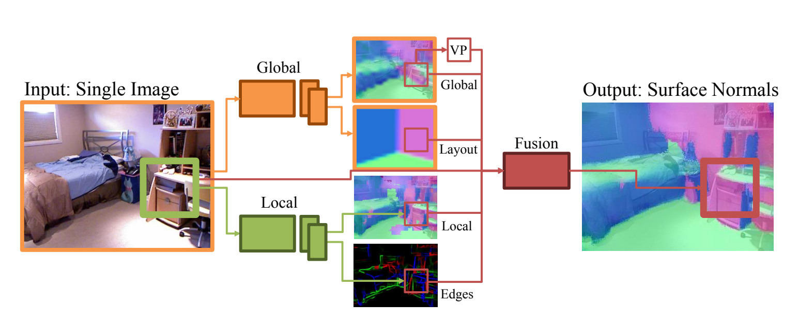
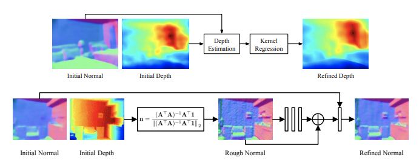
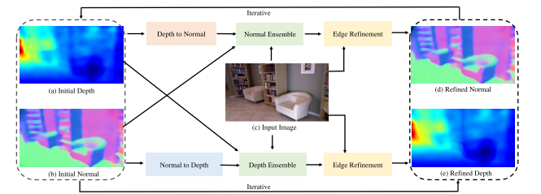

**Normal estimation**

1. Paper: (CVPR 2015) Designing Deep Networks for Surface Normal Estimation
* 
* single image로 부터 surface normal을 predict
* global and local process로 나누고 CNN을 사용하여 normal predict
* ground truth image는 kinect image를 사용하며 학습 시 ground truth label을 넣어준다.

2. Paper: (CVPR 2018) GeoNet: Geometric Neural Network for Joint Depth and Surface Normal Estimation
* 
* 2가지 stream의 CNN(depth-to-normal, normal-to-depth)로 구성되어 있다.
* initial normal과 depth로 부터 depth estimation을 진행하고 point cloud 생성
* point cloud로 부터 normal을 refine하여 사용한다. 
* ground truth depth가 필요하다.

3. Paper: (IEEE 2022) GeoNet++: Iterative Geometric Neural Network with Edge-Aware Refinement for Joint Depth and Surface Normal Estimation
* 
* geonet에서 normal to depth와 depth to normal을 반복적으로 수행하여 성능 향상. 