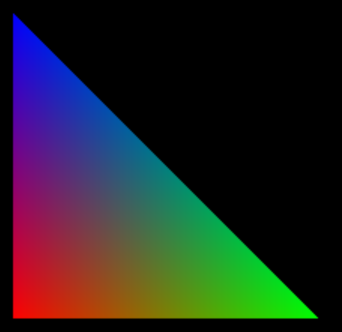
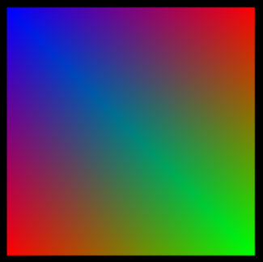
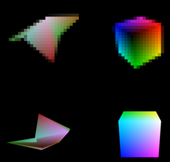
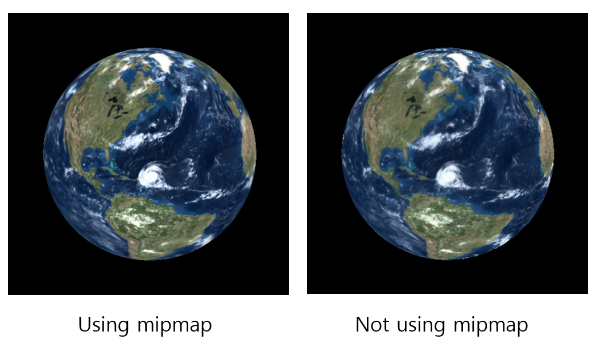

* NVdiffrast 실험 환경 구축
	* docker build
```python 
./run_sample.sh --build-container 
``` 
* dataset: triangle, cube, earth, pose, envphong

* python opengl 
	* triangle dataset에 대한 example
	* ./run_sample.sh 수정
```python
docker run --rm -it --gpus all --ipc=host --ulimit memlock=-1 --ulimit stack=67108864 --user $(id -u):$(id -g) \ -v `pwd`:/app --workdir /app -e TORCH_EXTENSIONS_DIR=/app/tmp $image python3 $sample $rest
```
*  cuda나 opengl argument 넣어준다. 
```python
 ./run_sample.sh ./samples/torch/triangle.py --cuda
 ./run_sample.sh ./samples/torch/triangle.py --opengl
```

* hello triangle
*  
* triangle.py 변형하여 rectangle 출력
	```python
	pos = tensor([[[-0.8, -0.8, 0, 1], [0.8, -0.8, 0, 1], [-0.8, 0.8, 0, 1], [0.8, 0.8, 0, 1]]], dtype=torch.float32)
	col = tensor([[[1, 0, 0], [0, 1, 0], [0, 0, 1], [1, 0, 0], [0, 1, 0], [0, 0, 1]]], dtype=torch.float32)
	tri = tensor([[0, 1, 2], [1,3,2]], dtype=torch.int32)
	```
* 

* dataset에 대한 differentiable rendering
	* cube dataset
* resolution argument 반드시 넣어야 함
```python
		./run_sample.sh ./samples/torch/cube.py --outdir result --resolution 32
```
* opengl argument를 추가하면 error가 더 줄어든다.
```python
		./run_sample.sh ./samples/torch/cube.py --outdir result --resolution 32 --opengl
```
* discontinuous argument를 사용하면 cube_d.npz file로 학습된다. 
```python
		./run_sample.sh ./samples/torch/cube.py --outdir result --resolution 32 --  discontinuous
```
* results
 

* earth dataset
	* 영상이 아닌 img와 texture가 저장된다.
* using mipmap
```python
		./run_sample.sh ./samples/torch/earth.py --outdir result --mip
```
* not using mipmap
```python
		./run_sample.sh ./samples/torch/earth.py --outdir result
```
* results
		* 
		* PSNR은 각각 33.90과 25.44로 많이 차이
