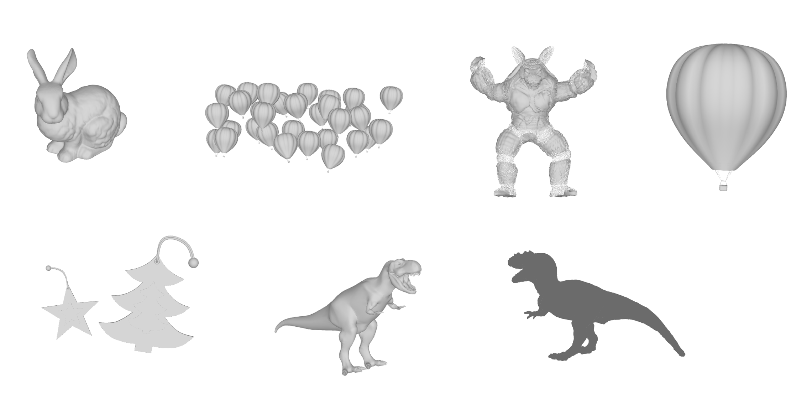

**mesh obj file ➡️ NVDiffrast npz fie**
* to_npz.py
```python
import numpy as np

def obj_to_npz(obj_file, npz_file):

    vertices = []
    texture_coords = []
    normals = []
    faces = []

    with open(obj_file, 'r') as f:

        for line in f:
            tokens = line.strip().split()
            if len(tokens) == 0:
                continue

            if tokens[0] == 'v':
                vertex = [float(tokens[1]), float(tokens[2]), float(tokens[3])]
                vertices.append(vertex)

            elif tokens[0] == 'vt':
                texture_coord = [float(tokens[1]), float(tokens[2])]
                texture_coords.append(texture_coord)

            elif tokens[0] == 'vn':
                normal = [float(tokens[1]), float(tokens[2]), float(tokens[3])]
                normals.append(normal)

            elif tokens[0] == 'f':
                face = [int(tokens[1].split('/')[0]) - 1, int(tokens[2].split('/')[0]) - 1, int(tokens[3].split('/')[0]) - 1]
                faces.append(face)

    vertices = np.array(vertices)
    texture_coords = np.array(texture_coords)
    normals = np.array(normals)
    faces = np.array(faces)
    ones_arr = np.ones_like(vertices)
    np.savez(npz_file, arr_0=faces, arr_1=vertices, arr_2=faces, arr_3=ones_arr)

obj_file = '/home/cglab/project/ms/nvdiffrast/samples/data/chrismas_blue.obj'
npz_file = '/home/cglab/project/ms/nvdiffrast/samples/data/chrismas_blue.npz'
obj_to_npz(obj_file, npz_file)
```
* obj mesh file 입력 받아 NVDiffrast에서 사용하는 npz file로 parsing

* **사용한 mesh (online 3D viewer 사용하여 mesh 확인)**
	* stanford bunny ✅
	* stanford armadillo ✅
	* stanford tyrannosaurus ✅
	* rex balloon
	* rex balloon(1개만) ✅
	* rex christmas blue 
	* rex dino
	* 
	* rex balloon, christmas blue는 여러 개의 mesh로 구성되어 있어서 문제 발생
		* mesh의 개수만큼 시작 topology를 설정해야 할 것 같다. 
	* rex dino에서 공룡 하나의 mesh만 추출하여 differentiable rendering 진행하였지만 시작 좌표가 (0,0,0)이 아니라 문제 발생
		* look-at matrix 사용하여 matrix 수정해야 함
	* 각각의 differentiable rendering 결과는 \\115.145.173.100\project\drast\result 