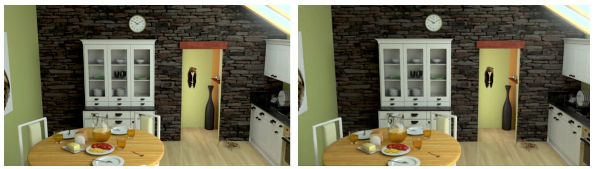

* **ETRI에서 제공해준 npy file에 대한 실험 (Ref-NeRF)**
	* epoch size:15625, epoch:4
	* 결과만 확인하기 위하여 62500번의 iteration만 진행하였다. (기존의 1/16)
	* geometry가 매우 잘 잡히는 것을 확인하였다. 
	* PSNR: 26.524
	* 현재 default setting에 맞춰서 학습을 진행 중이다. 
	* 

* NeRF pytorch에 대한 실험
	* colmap에서 추출한 npy file 사용한 실험
		* 
		* 여전히 앞 부분의 geometry가 무너진다.
	
	* **ETRI에서 제공 받은 npy file 사용한 실험**
		* 
		* epoch_size: 100000
		* PSNR: 27.094
		* geometry가 정확하게 잘 잡히고 있음을 확인하였다. 

* normal map 중요성 여부 확인
	* normal map 중요성 여부 확인 위해 normal이 있는 synthetic data에 대하여 normal map 제외하고 training 진행해보려고 하였다.
	* specular가 존재하는 car, helmet, ball dataset에 대하여 colmap이 동작하지 않는 것을 확인하였다. 
	* specular가 존재하지 않는 lego dataset에 대해서는 제대로 동작한다.

* Normal map extraction
	* derived normal과 predict normal의 비교
	* Ref-NeRF에서 normal estimation이 잘 이루어지지 않고 있음을 확인하였다. 

	 ```python
	 normals_deriv = (rendered_results[1]["weights"][..., None] * rendered_results[1]["normals"]).sum(1)
	 normals_deriv = ref_utils.l2_normalize(normals_deriv)
	 ret["derived_normal"] = normals_deriv
	 
	 normals_pred = (rendered_results[1]["weights"][..., None]*rendered_results[1]["normals_pred"]).sum(1)
	 normals_pred = ref_utils.l2_normalize(normals_pred)
	 ret["pred_normal"] = normals_pred
	```
	* Results
	*  